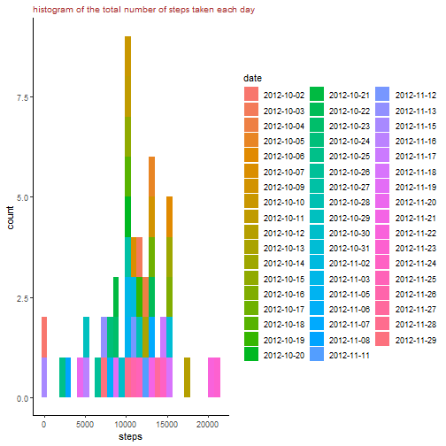
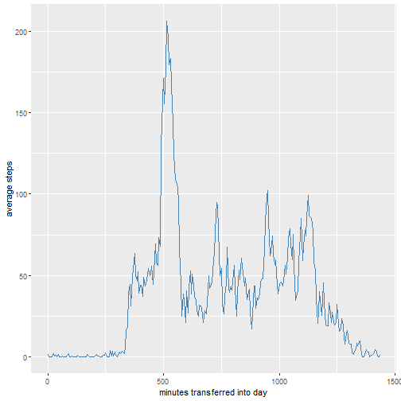
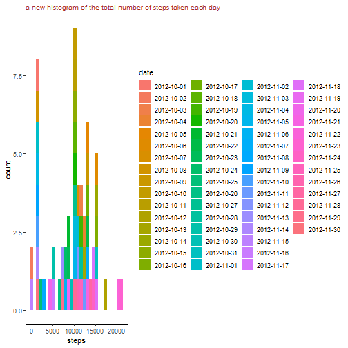
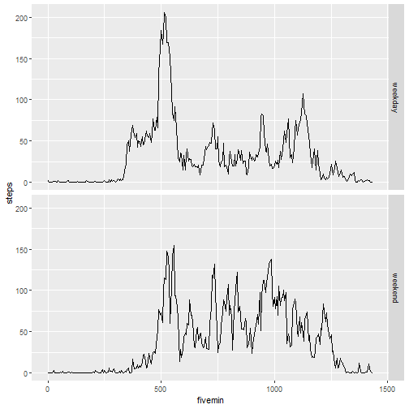

## Loading and preprocessing the data


```r
library(knitr)
library(xtable)

filename<-"reproducible_assign_1.zip"

if(! file.exists(filename)){
        fileurl<-"https://d396qusza40orc.cloudfront.net/repdata%2Fdata%2Factivity.zip"
        download.file(fileurl,filename)
}

if(!file.exists("Activity")){
        unzip(filename)
}
```

### get and clean the data (change to the correct time format)


```r
dat<-read.csv("activity.csv",header = T)
dat$date<-strptime(dat$date,"%Y-%m-%d")
##make equally-spaced time labels
dat$fivemin<-dat$interval%%100+60*dat$interval%/%100 
```


## What is mean total number of steps taken per day?

### Calculate the total number of steps taken per day


```r
cleardat<-dat[!is.na(dat$steps),]
cleardat$date<-as.factor(cleardat$date)
total_step_day<-aggregate(steps~date,data=cleardat,FUN=sum)
total_step_day
```

```
##          date steps
## 1  2012-10-02   126
## 2  2012-10-03 11352
## 3  2012-10-04 12116
## 4  2012-10-05 13294
## 5  2012-10-06 15420
## 6  2012-10-07 11015
## 7  2012-10-09 12811
## 8  2012-10-10  9900
## 9  2012-10-11 10304
## 10 2012-10-12 17382
## 11 2012-10-13 12426
## 12 2012-10-14 15098
## 13 2012-10-15 10139
## 14 2012-10-16 15084
## 15 2012-10-17 13452
## 16 2012-10-18 10056
## 17 2012-10-19 11829
## 18 2012-10-20 10395
## 19 2012-10-21  8821
## 20 2012-10-22 13460
## 21 2012-10-23  8918
## 22 2012-10-24  8355
## 23 2012-10-25  2492
## 24 2012-10-26  6778
## 25 2012-10-27 10119
## 26 2012-10-28 11458
## 27 2012-10-29  5018
## 28 2012-10-30  9819
## 29 2012-10-31 15414
## 30 2012-11-02 10600
## 31 2012-11-03 10571
## 32 2012-11-05 10439
## 33 2012-11-06  8334
## 34 2012-11-07 12883
## 35 2012-11-08  3219
## 36 2012-11-11 12608
## 37 2012-11-12 10765
## 38 2012-11-13  7336
## 39 2012-11-15    41
## 40 2012-11-16  5441
## 41 2012-11-17 14339
## 42 2012-11-18 15110
## 43 2012-11-19  8841
## 44 2012-11-20  4472
## 45 2012-11-21 12787
## 46 2012-11-22 20427
## 47 2012-11-23 21194
## 48 2012-11-24 14478
## 49 2012-11-25 11834
## 50 2012-11-26 11162
## 51 2012-11-27 13646
## 52 2012-11-28 10183
## 53 2012-11-29  7047
```

### Make a histogram of the total number of steps taken each day


```r
library(ggplot2)
total_step_day$date<-as.factor(total_step_day$date)

step_each_day_plot<-ggplot(total_step_day,aes(x=steps))+geom_histogram(aes (fill=date),bins=30)+ggtitle("histogram of the total number of steps taken each day")+theme_classic()+theme(plot.title = element_text(size=10,color="brown"))

        
step_each_day_plot
```



### Calculate and report the mean and median of the total number of steps taken per day


```r
library(dplyr)
total_step_day_report<-total_step_day%>%summarise("steps",mean=mean(steps),median=median(steps))

total_step_day_report
```

```
##   "steps"     mean median
## 1   steps 10766.19  10765
```


## What is the average daily activity pattern?

### Make a time series plot (i.e. type = "l") of the 5-minute interval (x-axis) and the average number of steps taken, averaged across all days (y-axis)


```r
library(plyr)
##calculating the average steps
average_step_by_minute<-ddply(cleardat,~fivemin,summarise,steps=mean(steps))

##plotting
average_step_plot<-ggplot(average_step_by_minute,aes(x=fivemin,y=steps))+geom_line(color="steelblue")+labs(x="minutes transferred into day",y="average steps")

average_step_plot
```



### Which 5-minute interval, on average across all the days in the dataset, contains the maximum number of steps?


```r
max_average_step<-which(average_step_by_minute$steps==max(average_step_by_minute$steps))
max_fivemin<-average_step_by_minute$fivemin[max_average_step]
max_interval<-dat$interval[which(dat$fivemin==max_fivemin)][1]
max_interval
```

```
## [1] 835
```


## Imputing missing values

### Calculate and report the total number of missing values in the dataset (i.e. the total number of rows with NAs)


```r
dat$date<-as.factor(dat$date)
nrow(dat[!complete.cases(dat),])
```

```
## [1] 2304
```

### Devise a strategy for filling in all of the missing values in the dataset. (use the mean for that 5-minute interval)


```r
five_min_median<-aggregate(steps~fivemin,data=dat,FUN=median)
five_min_median<-five_min_median%>%mutate(code=as.factor(five_min_median$fivemin))
dat<-dat%>%mutate(code=as.factor(dat$fivemin))
```

### Create a new dataset that is equal to the original dataset but with the missing data filled in.


```r
##create a new data frame fill for the NA values in steps
fill<-dat[which(is.na(dat$steps)),]
fill<-fill%>%mutate(steps=five_min_median[code,2])

##combine with the original data frame(with out NAs)
newdat<-rbind(fill,dat[complete.cases(dat),])
```

### Make a histogram of the total number of steps taken each day and Calculate and report the mean and median total number of steps taken per day. 


```r
##plotting
new_total_step_day<-aggregate(steps~date,data=newdat,FUN=sum)

new_step_each_day_plot<-ggplot(new_total_step_day,aes(x=steps))+geom_histogram(aes (fill=date),bins=30)+ggtitle("a new histogram of the total number of steps taken each day")+theme_classic()+theme(plot.title = element_text(size=10,color="brown"))

        
print(new_step_each_day_plot)
```



```r
##calculating mean and median
new_total_step_day_report<-new_total_step_day%>%summarise("steps",mean=mean(steps),median=median(steps))

print(new_total_step_day_report)
```

```
##   "steps"     mean median
## 1   steps 9503.869  10395
```

### Do these values differ from the estimates from the first part of the assignment? What is the impact of imputing missing data on the estimates of the total daily number of steps?

**There mean and median values decrease, and the number of low numbers of steps increase**


## Are there differences in activity patterns between weekdays and weekends?

### Create a new factor variable in the dataset with two levels – “weekday” and “weekend” indicating whether a given date is a weekday or weekend day.


```r
newdat<-select(newdat,-code)
newdat$date<-strptime(newdat$date,"%Y-%m-%d")
newdat<-newdat%>%mutate(week=weekdays(newdat$date))

weekday<-c("Monday","Tuesday","Wednesday","Thursday","Friday")

##using sapply instead of lapply to not generate list
newdat$week<-sapply(newdat$week,function(x)if (x%in% weekday){x<-"weekday"} else {x<-"weekend"})

newdat$week<-as.factor(newdat$week)
```


### Make a panel plot containing a time series plot (i.e. type = "l") of the 5-minute interval (x-axis) and the average number of steps taken, averaged across all weekday days or weekend days (y-axis). The plot should look something like the following, which was created using simulated data:


```r
week_step_day<-aggregate(steps~fivemin+week,data=newdat,FUN=mean)

ggplot(week_step_day,aes(x=fivemin,y=steps))+geom_line()+
        facet_grid(week~.)
```



